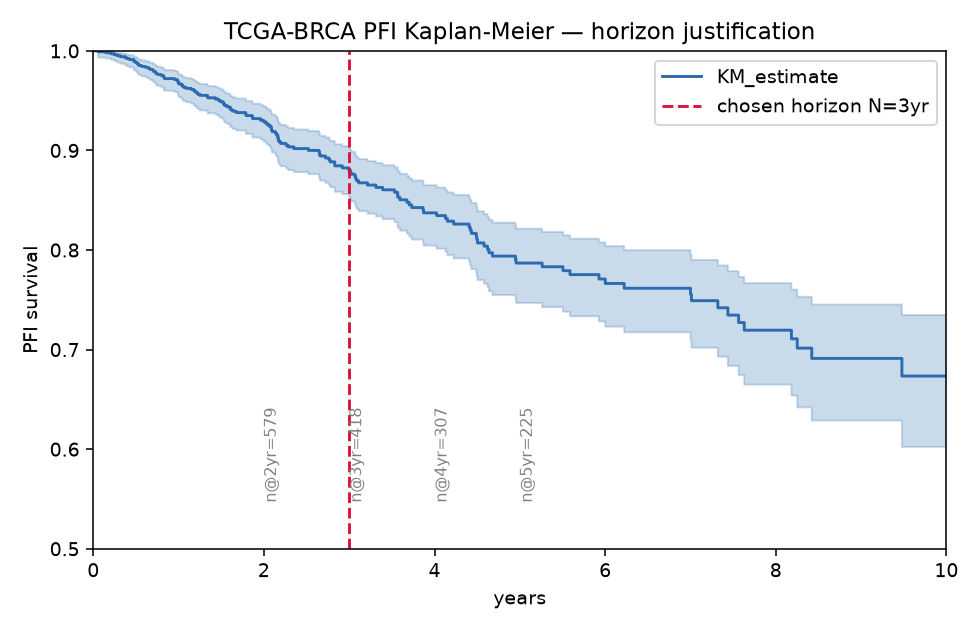
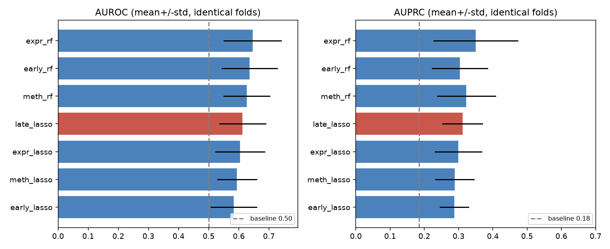
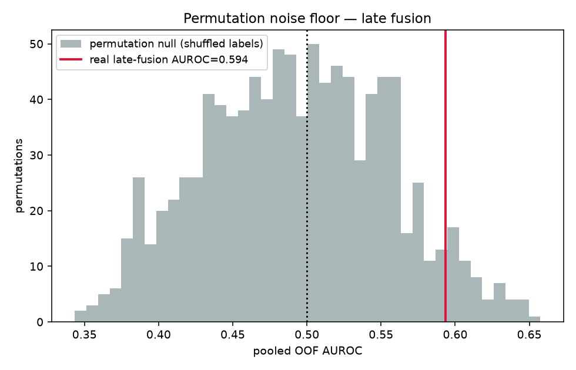

# Results — does methylation add orthogonal signal for BRCA relapse?

**Headline (a trustworthy null).** In a leak-free, identical-fold, permutation-validated
comparison, **DNA methylation does not add predictive signal beyond gene expression for
3-year relapse in TCGA-BRCA.** Expression alone carries weak-but-real signal
(pooled OOF AUROC 0.60, permutation p = 0.024); late fusion with methylation does **not**
improve on it (0.59, p = 0.058) and does not clear the permutation noise floor.
Methylation independently recovers known biology (PITX2), but that orthogonal signal is
not strong enough to help prediction here. The result is the measurement, not the direction.

## Cohort
- Modeling set: **368 patients, 68 relapse events (18.5%)** after intersecting expression
  ∩ 450k methylation ∩ clinical, primary-tumor only, N=3yr labelling (censored-before-3yr
  dropped as ambiguous). Median PFI follow-up ~2.1 yr — the reason for fixed-horizon binary.
- Horizon N=3yr chosen from the KM at-risk table (`results/01_horizon_table.csv`): N=2 too
  few events (62, 9.7%); N=5 drops 68% of patients to censoring. N=3 balances events (89
  pre-methylation) against selection bias.

## Regime comparison (identical 5-fold splits, mean ± std)
| Regime | AUROC | AUPRC (baseline 0.185) |
|---|---|---|
| expr_rf (best single-omics) | 0.646 ± 0.097 | 0.350 ± 0.123 |
| early_rf | 0.636 ± 0.093 | 0.303 ± 0.082 |
| meth_rf | 0.627 ± 0.078 | 0.323 ± 0.086 |
| **late_lasso (headline)** | 0.613 ± 0.078 | 0.311 ± 0.059 |
| expr_lasso | 0.605 ± 0.083 | 0.299 ± 0.070 |
| meth_lasso | 0.594 ± 0.067 | 0.289 ± 0.058 |
| early_lasso | 0.583 ± 0.078 | 0.288 ± 0.043 |

All regimes cluster in AUROC 0.58–0.65 with fold std ~0.08–0.10 — i.e. the differences
between regimes are **within fold-to-fold noise**. No regime dominates.

## Late-fusion meta-learner — the betas ARE the result
`p_final = σ(-1.95 + 0.79·p_expr + 0.70·p_meth)`

β_meth is non-zero, so the in-sample meta-learner *does* place weight on methylation.
**But a non-zero beta is not a generalizable gain:** evaluated out-of-fold, late fusion
(pooled AUROC 0.594) does not beat expression alone (0.603). The two readings together are
the honest nuance — methylation looks useful when the meta-learner fits, but it does not
survive held-out evaluation or the permutation floor.

## Permutation noise floor (1000× full-pipeline label shuffle; Phipson–Smyth p)
| Arm | Real (pooled OOF AUROC) | Null mean | Null p95 | Empirical p |
|---|---|---|---|---|
| expression-only | 0.603 | 0.494 | 0.583 | **0.024** |
| late fusion | 0.594 | 0.493 | 0.596 | **0.058** |

The null centres at ~0.49 for both (labels shuffled ⇒ chance ranking), confirming the test
is calibrated. Expression clears the floor (p=0.024); **late fusion does not (p=0.058), and
its real AUROC sits below the null's 95th percentile.** Adding methylation moved the model
*toward* the noise floor, not away from it. Shuffle wrapped the entire supervised pipeline
including feature selection.

## External validation — expression arm on METABRIC (scope-bounded)
- METABRIC: 1,903 patients, 359 relapse events (18.9%, matches TCGA's 18.5%), 16,771 shared
  genes; per-gene z-score harmonisation across RNA-seq/microarray.
- **AUROC 0.553, AUPRC 0.218** (baseline 0.189). The TCGA-trained expression model barely
  transfers cross-cohort — within-cohort CV is optimistic. **The fusion claim remains
  single-cohort (TCGA); METABRIC has no matched 450k methylation, so the integrated model
  is not externally validated.** Stated as the primary limitation.

## Biology sanity check
- **Methylation selection independently recovers PITX2** — the canonical, clinically
  validated DNA-methylation prognostic biomarker in breast cancer. Strong evidence the
  methylation arm latches onto real regulatory biology, not artefact.
- **Zero gene overlap** between expression-selected and methylation-selected features →
  the layers point at genuinely different biology (orthogonality confirmed at the feature
  level). Orthogonal ≠ additive-for-prediction: the signal is real but too weak to help.
- Expression-selected genes hit none of the curated known loci and look noise-like,
  consistent with the weak expression AUROC.

---

# Discussion points (interview ammunition)

**Why relapse, not PAM50.** PAM50 subtype is ~95% predictable from expression alone, so a
second omics layer has no headroom to demonstrate value — you cannot beat a solved problem.
Relapse is where expression is mediocre (here AUROC ~0.60), which is exactly the regime
where an orthogonal layer *could* help. Choosing the hard endpoint is what makes a null
informative rather than a foregone conclusion.

**Why methylation, not CNV.** CNV is largely redundant with expression — amplified genes
are typically over-expressed, so CNV and expression share information. Promoter methylation
silences genes through a mechanism distinct from expression magnitude, so it *can* carry
information expression does not. We framed this as a hypothesis to test, not a claim — and
the feature-level result (methylation recovers PITX2, no gene overlap with expression)
confirms the orthogonality even though it did not translate into predictive gain.

**Why fixed-horizon binary.** TCGA-BRCA follow-up is short (median ~2.1 yr) and relapse is
late, so a time-to-event model would claim survival-model power the censoring cannot
support. Binarising at N=3yr discards timing information — a deliberate trade — and we chose
N from the KM at-risk table, not arbitrarily, dropping patients censored before the horizon
because they are not clean negatives. Naming the censoring limitation out loud is the point.

**Why late fusion over early/DIABLO.** Late fusion gives each layer its own model and lets a
logistic meta-learner weigh their probabilities, so it isolates each layer's contribution
(the betas), sidesteps the 450k-vs-20k dimensionality-dominance problem instead of fighting
it, and stays interpretable. Early fusion is the naive comparator; DIABLO/autoencoders are
heavier machinery that would not change this answer. Restraint over machinery.

**Why the comparison design is the result.** Every regime is scored on identical folds, with
feature selection, scaling, imputation and label filtering fit inside the training fold only,
and out-of-fold base predictions feeding the meta-learner. That makes single-vs-fused a fair,
paired comparison — so when fusion does not beat the baseline, the design is trustworthy
enough to believe the null rather than blame the pipeline.

**The permutation test.** Shuffling labels and rerunning the *entire* supervised pipeline
(including feature selection) 1000× builds the noise floor at ~0.49 AUROC. Expression clears
it (p=0.024); late fusion does not (p=0.058). This rules out high-dimensional overfitting as
the source of the modest AUROC — permuting only the final classifier would measure the wrong
floor. Almost no junior candidate establishes this floor.

**METABRIC.** External validation of the expression arm (AUROC 0.55) shows the within-cohort
signal is largely cohort/platform-specific — honest evidence that single-cohort CV overstates
generalization. The fusion claim is deliberately *not* externally validated (no matched
methylation in METABRIC), and that scope limit is stated rather than glossed.

**Discovery under uncertainty.** We did not know the answer going in. A leak-free,
permutation-validated, externally-referenced comparison was built precisely so a null would
be believable — and it landed on a null: methylation carries real, orthogonal biology (PITX2)
that is nonetheless too weak to improve 3-year relapse prediction beyond expression in this
cohort. Trustworthy either way is the deliverable; here, the way it fell is "it doesn't help."

## Caveats / limitations
- Only 68 events ⇒ wide fold variance; small true effects could be undetectable (power, not
  proof of absence). The permutation p=0.058 for fusion is "not significant," not "signal
  proven absent."
- Global unsupervised variance prefilter of methylation to 50k probes (label-blind, disclosed)
  bounds compute for the 1000× permutation; supervised selection is per-fold.
- Fixed pre-specified regularisation (no nested tuning) to avoid optimistic bias at low EPV;
  the same config is reused by the null so real-vs-null is fair.
